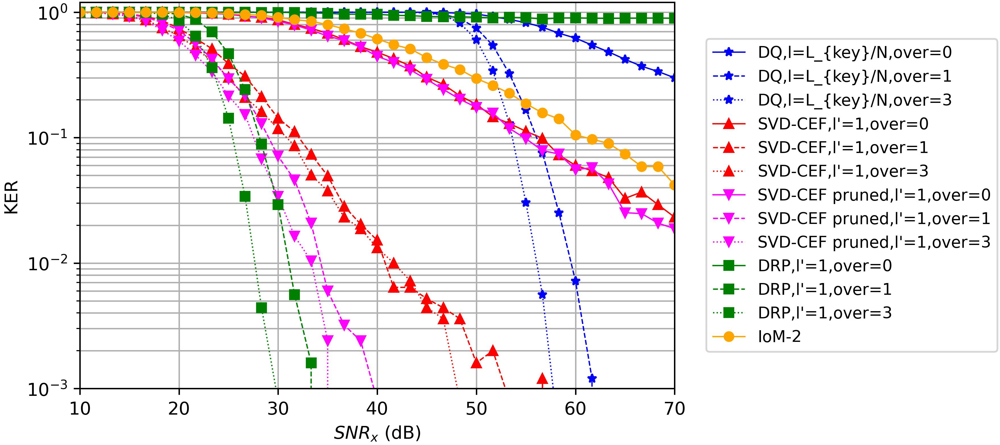

# Secret Key Generation by Continuous Encryption Before Quantization

For detiled description please refer to our SPL22 [paper](https://intra.ece.ucr.edu/~yhua/Reprint_Maksud_Hua_SPL_2022.pdf) and [slides](https://drive.google.com/file/d/1P2Kfo6XTSxgTHtST4UqO3YfeDz5f6XXX/view?usp=sharing). The [main_test.py](main_test.py) geneartes data and logs into [data_plots](data_plots) folder. The [CEF_modules](CEF_modules) contain core modules for Continuous Encryption Function.

## Introduction
Secret Key Generation (SKG) is a long standing problem for network security applications. For wireless security, a pair of nodes (Alice and Bob) in a wireless network can exploit their reciprocal channel state information to generate a secret key. Such a key shared by Alice and Bob can be then used as a symmetric key for information encryption between them over any networks.

A central issue of SKG is how to best transform a pair of highly correlated secret vectors (SVs) at Alice and Bob, respectively, into a pair of nearly identical sequences of binary bits (i.e., keys). The SVs are in practice quasi-continuous (due to the finite precision of real number representation). Since the two SVs collected at Alice and Bob are generally not equal, the probability of the generated keys being unequal, i.e., key error rate (KER), is generally nonzero. So, a central objective of SKG is to minimize KER.

The major steps of SKG for both wireless security and biometric security are: extraction of SVs, which should be maximally correlated with each other and contain the minimal amount of non-secret, quantization of SVs with KER as small as possible, and reconciliation and privacy amplification for improved key. In this project, we focus on the problem of quantization to turn a pair of SVs into a pair of keys with any length, small KER, and sufficient randomness.

## System Model
Alice and Bob share noisy versions of the common reciprocal random vector denoted as $x$. This vector can be any shared quantity between Alice and Bob, e.g., the reciprocal channel between them. This shared vector is of limited dimension, and extracting a sufficiently long secret key through quantization will result in key error. To overcome this, we propose to use an SVD-based Continuous Encryption Function in order to enhance the dimension of the shared vector. The CEF converts $x$ into $y$, where $y$ has a much higher dimension than $x$. This results in the extraction of fewer bits per sample for a fixed length of secret key. bits/sample can be as low as $1$ and even less than $1$ (which we refer to as fractional quantization).
The above plots show the performance of SVD CEF for reliable SKG. We compare with Direct Quantization and two other state-of-the-art encryption functions (Dynamic Random Projection-DRP and Index-of-Max hashing-IoM2). It is clear that SVD-CEF performs far better than others. Although DRP provides better KER than SVD-CEF, it is shown in our paper to be not secure against attacks.
